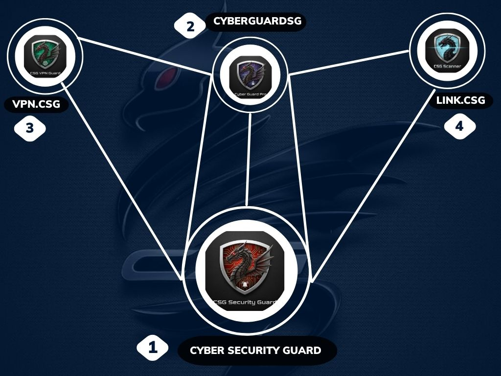
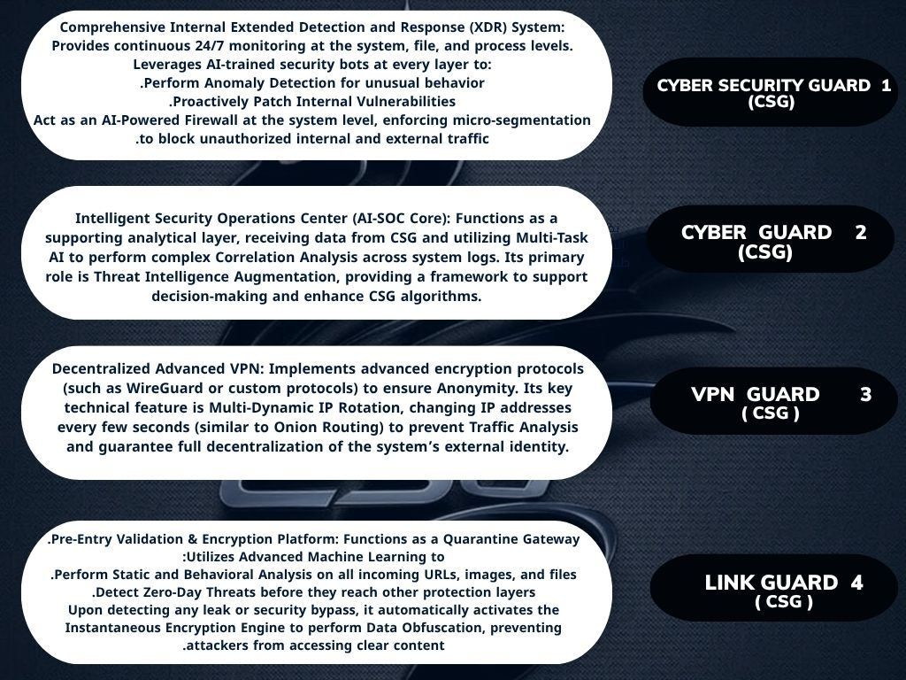
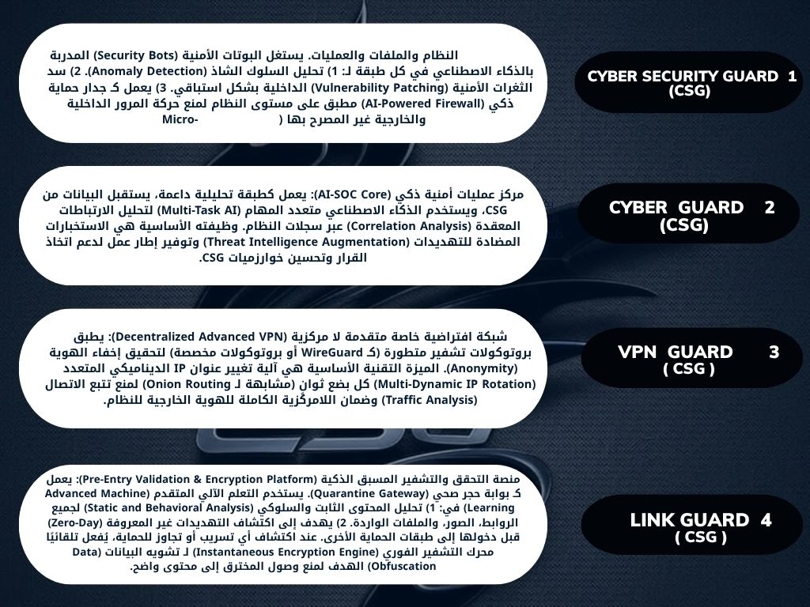

# 🛡️ Cyber Security Guard Defense Stack

🌍 Available Languages: [English](README.md) | [العربية](README.ar.md)

  

A multi-layered cybersecurity ecosystem integrating AI-driven threat detection, decentralized VPN anonymity, and intelligent link validation.
Designed for ethical security research and defensive operations, fully automated through SOAR orchestration.

---

# Project Identity

| Field | Value |
|-------|-------|
| Version | 1.0.0 |
| Technologies | AI • SOAR • VPN • Threat Intelligence |
| Status | ✅ Stable — Production Ready |
| License | Apache-2.0 |
| Languages | English & Arabic |

---

# Table of Contents

- System Overview  
- Architecture Summary  
- Component Breakdown  
- System Requirements  
- Automation Scenarios (via N8N)  
- Visual Assets  
- License & Ethical Use  
- Developer & Contact  
- Project Repositories  
- Evolution & Previous Versions

---

# System Overview

The Cyber Security Guard Defense Stack consists of four integrated modules designed to deliver adaptive monitoring, proactive defense, and automation efficiency:

- 🔒 CSG — Core AI-XDR engine for real-time detection and incident response  
- 🧩 CG — AI-SOC and threat intelligence for behavioral and correlation analysis  
- 🌐 VPN.CSG — Decentralized VPN for anonymity and secure routing  
- 🔗 Link.CSG — Validation gateway for scanning URLs and files before access

All modules communicate securely via APIs and integrate seamlessly with N8N for workflow automation.

---

# Architecture Summary

The stack forms a triangular defense topology: CSG acts as the control center, linking with CG, VPN.CSG, and Link.CSG.

Capabilities include:

- Behavioral anomaly analysis  
- Threat correlation and augmentation  
- Obfuscation and encryption  
- IP rotation and stealth routing

  

---

# Component Breakdown

### Cyber Security Guard (CSG)
- Continuous real-time monitoring  
- AI-based anomaly detection  
- Proactive vulnerability patching  
- Malware and ransomware defense  
- Micro-segmentation and isolation

### Cyber Guard (CG)
- Real-time event correlation  
- Multi-layer AI analytics  
- Threat intelligence enrichment  
- Compliance and detection enhancement

### VPN Guard (VPN.CSG)
- Advanced encryption (WireGuard, IPsec)  
- Anonymous routing and IP rotation  
- Multi-hop secure tunneling  
- Decentralized authentication nodes

### Link Guard (Link.CSG)
- URL and file quarantine scanning  
- Metadata verification  
- Deep AI content analysis  
- Threat isolation before user access

---

# System Requirements

- Operating Systems: Linux (Ubuntu preferred), Windows Server, Docker  
- Automation Engine: N8N (Docker recommended)  
- Programming Environments:
  - Python (CG, Link.CSG)
  - Rust (CSG Core)
  - Node.js (VPN.CSG, N8N)

---

# Automation Scenarios (via N8N)

### Scenario 1 — Internal Incident Response
Trigger: CSG detects abnormal system behavior  
Action: Isolate endpoint → Correlate via CG → Report via N8N

### Scenario 2 — Malicious Link Interception
Trigger: URL or file passes through gateway  
Action: Link.CSG scans → Block if malicious → Notify CSG

### Scenario 3 — Zero-Day Patch Deployment
Trigger: CG identifies new global threat  
Action: N8N coordinates patch rollout through CSG

---

# Visual Assets

Primary diagrams for current release:

  

English diagrams (kept available for reference):

- docs/en/n8n.jpg (previous workflow image)  
- docs/en/n8n.0.png  
- docs/en/architecture.png

Note: the images under docs/en and docs/ar are previous versions retained to show project evolution.

---

# License & Ethical Use

This platform is built exclusively for ethical cybersecurity research and defensive applications.
Unauthorized testing or offensive actions are strictly prohibited.
License: Apache-2.0

---

# Developer & Contact

Alaa Mahmoud Mohamed  
Independent Cybersecurity Tools Developer  
Location: Giza, Egypt

Contact:
- Primary project contact: csg4team@proton.me  
- Project email: alaamahmoudmohamed89@gmail.com  
- Personal email: alaat9080@gmail.com  
- LinkedIn: https://www.linkedin.com/in/alaa-mahmoud-mohamed-918aba378  
- GitHub: https://github.com/alaat9080-svg/cyber-security-guard-pro  
- X (Twitter): https://x.com/alaamahm0ud89  
- Phone: +20 22595905

---

# Project Repositories

| Module | Repository |
|--------|------------|
| Profile | https://github.com/Alasarmamhd/Alaamahm0ud.git |
| Cyber Guard Pro | https://github.com/Alasarmamhd/cyber-guard-pro.git |
| Cyber Security Guard Pro | https://github.com/Alasarmamhd/cyber-security-guard-pro.git |
| VPN-GUARD (SCG) | https://github.com/Alasarmamhd/VPN-GUARD.-SCG-.git |
| Linkgarde CSG | https://github.com/Alasarmamhd/linkgarde.csg.git |
| Full Stack | https://github.com/Alasarmamhd/Cyber-Security-Guard-Defense-Stack.git |

---

# Evolution & Previous Versions

We keep legacy diagrams and older workflow images to reflect iteration history and improvements.

Previous assets:
- docs/en/n8n.jpg  
- docs/en/architecture.png  
- docs/ar/n8n.jpg  
- docs/ar/architecture.png

---

Built as a complete AI-driven defense ecosystem to empower ethical researchers, analysts, and engineers in the evolving landscape of cybersecurity.
