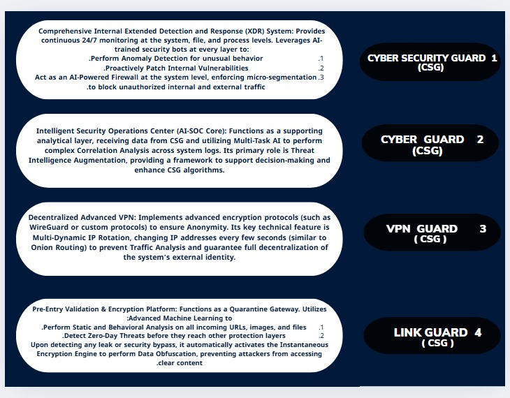
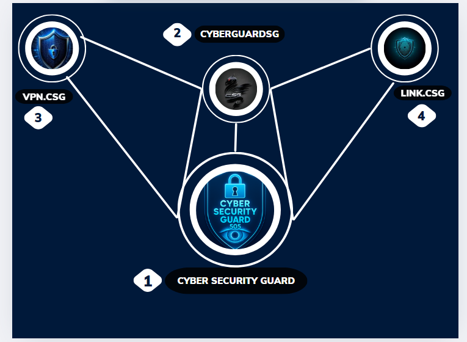
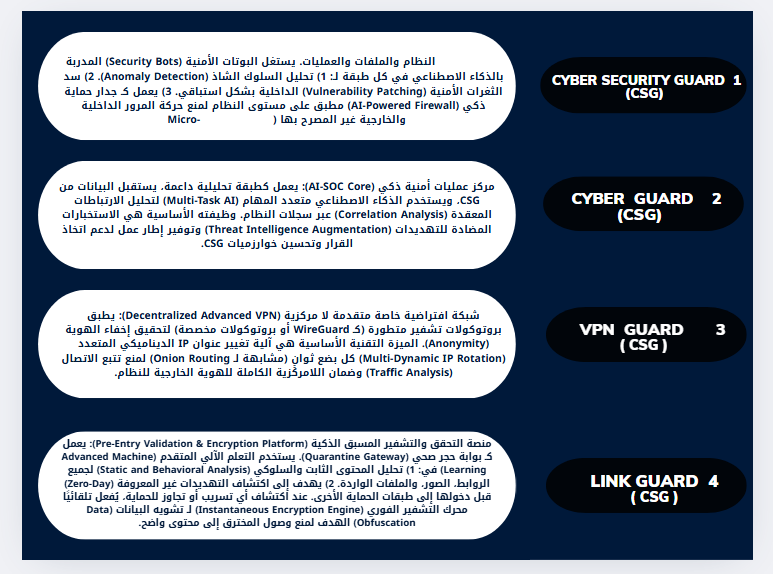

# 🖼️ Cyber Security Guard 505 — Visual Guide  
# 🖼️ دليل بصري لمشروع Cyber Security Guard 505

---

## 🔐 English Overview

> This diagram shows the modular structure of the defense stack, including VPN, link protection, bot coordination, and N8N automation.

---

> This image explains how the modules interact with N8N to form a resilient, AI-powered cybersecurity system.

---

## 🔐 نظرة عربية

> توضح هذه الصورة البنية الدفاعية للنظام، بما يشمل حماية VPN، الروابط، البوتات، وربط N8N التلقائي.

---

> تشرح هذه الصورة كيفية تفاعل الوحدات مع N8N لتكوين منظومة أمنية ذكية ومتعددة الطبقات.

---

## ✍️ Prepared & curated by  
**Alaa Mahmoud Mohamed Awadallah**  
Cybersecurity Developer & Visual Architect  
📧 alaat9080@gmail.com  
🔗 [GitHub Profile](https://github.com/Alaaammoh0ud)

---

> This visual guide is part of the Cyber Security Guard Defense Stack — a community-driven, AI-powered framework for ethical digital protection.
